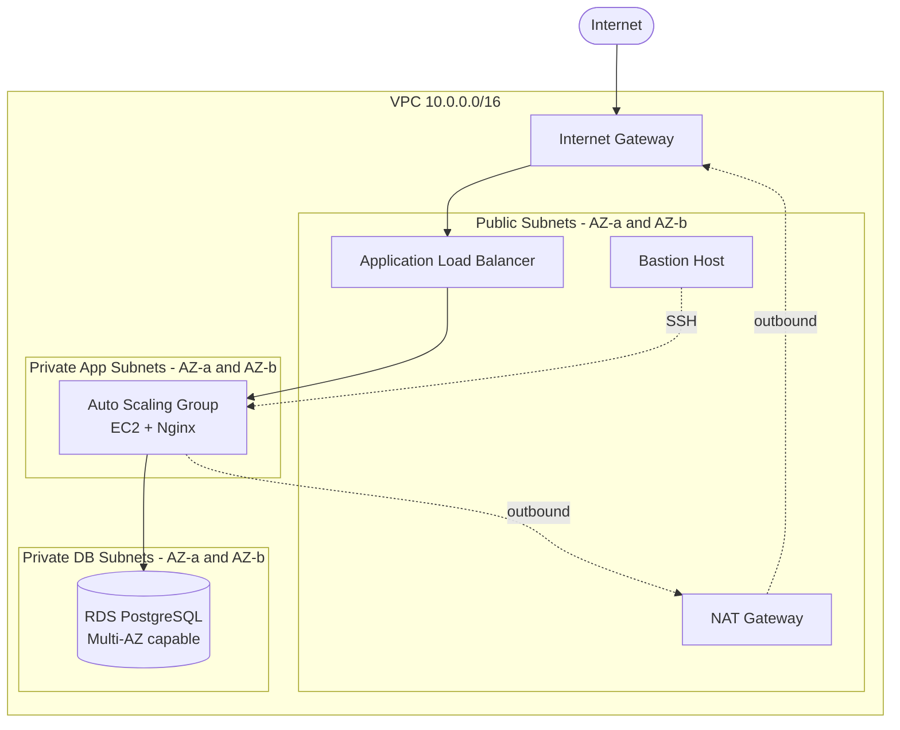

# 3-Tier AWS Infrastructure with Terraform

A production-style three-tier AWS architecture built entirely with Terraform. Public and private networks are divided across subnets, with an auto-scaling application tier behind an Application Load Balancer and a Multi-AZ-capable PostgreSQL RDS database — all defined as Infrastructure as Code (IaC) (Terraform).

## Architecture



## What It Provisions

The configuration creates a complete three-tier environment (~32 resources) (When we do the terraform apply there should e 32 resources created):

- **Networking** — a VPC, an Internet Gateway, six subnets (public, private-app, private-db, each across two AZs), a NAT Gateway with an Elastic IP, and three route tables with their subnet associations.
- **Security** — four security groups (ALB, bastion, app, RDS), each scoped to accept traffic only from the tier in front of it.
- **Load balancing** — an internet-facing Application Load Balancer, a target group with HTTP health checks, and a port 80 listener.
- **Compute** — a launch template (Ubuntu 24.04, Nginx installed via user data) and an Auto Scaling Group running across the private app subnets, plus a bastion host in a public subnet for SSH access.
- **Database** — a PostgreSQL RDS instance in the isolated private DB subnets, with encryption at rest and a dedicated DB subnet group.

## Design Decisions

### Three-tier network separation

The VPC is split into public, private-app, and private-db subnet tiers, each with its own routing and security group rules. This enforces defense in depth: external traffic can only reach the load balancer, which forwards to the app tier, which is the only thing permitted to reach the database. The DB subnets have no route to the internet at all — not even outbound through the NAT — so even a fully compromised database instance cannot exfiltrate data or call out to an attacker. Segmentation also limits blast radius: a breach in one tier does not automatically expose the others.

### Security group chaining

Rather than allowing traffic by IP range, each tier's security group permits traffic only from the security group of the tier in front of it — the app SG accepts traffic only from the ALB's SG, and the DB SG accepts only from the app's SG. This matters because the app instances run in an Auto Scaling Group and are constantly replaced, each getting a new private IP. IP-based rules would break every time an instance was recycled, but SG-based rules keep working regardless of how instances come and go. It is also self-documenting: a rule that says "allow from the app SG" states the intent directly, with no IP lists to maintain.

### Single NAT Gateway

All private-tier outbound traffic routes through one NAT Gateway rather than one per availability zone. This noticeably reduces cost (each NAT runs ~$32/month plus data charges), at the expense of availability: if the NAT's AZ fails, private instances lose outbound internet (package pulls, external API calls), though the public-facing app served through the ALB stays up. A production setup would run one NAT per AZ to remove this single point of failure.

### Multi-AZ RDS disabled in dev

The database runs as a single instance rather than with a standby replica in a second AZ. This roughly halves the database cost for a dev environment where occasional downtime is acceptable. For production it would be enabled — Multi-AZ maintains a synchronized standby that AWS automatically fails over to if the primary becomes unavailable, which is essential when downtime isn't an option.

## Prerequisites

- [Terraform](https://developer.hashicorp.com/terraform/install) >= 1.5.0
- An AWS account with an IAM user (not root) configured for CLI access
- AWS CLI installed and configured (`aws configure`)
- An SSH key pair for EC2/bastion access

Generate the SSH key referenced by the configuration:

```bash
ssh-keygen -t ed25519 -C "terraform-3tier" -f ~/.ssh/terraform_3tier
```

## Usage

1. Clone the repository and enter the Terraform directory:

   ```bash
   git clone https://github.com/ArinchSup/terraform-aws-tier3-infra.git
   cd terraform-aws-tier3-infra/terraform
   ```

2. Create a `terraform.tfvars` file (see `terraform.tfvars.example`) and set your database password:

   ```hcl
   db_password = "YourStrongPassword123"
   ```

3. Initialize, review the plan, and apply:

   ```bash
   terraform init
   terraform plan
   terraform apply
   ```

4. After apply completes, the ALB URL is printed as an output. Open it in a browser to see the Nginx page served across the auto-scaled instances:

   ```bash
   terraform output alb_dns_name
   ```

## Cost

Running the full stack 24/7 costs roughly **$80/month**, dominated by the NAT Gateway ($32) and ALB ($16). Hourly, that is about **$0.11**.

This is designed to be applied, tested, and destroyed in a single session — applying for an hour of testing costs only a few cents. Destroy the stack when not in use:

```bash
terraform destroy
```

## Roadmap (development path)

Planned that build on this foundation:

- **Remote state backend** — migrate state to S3 with DynamoDB locking for safe collaboration
- **Refactor into modules** — extract reusable VPC, compute, and database modules
- **Multi-environment** — parameterize for separate dev/staging/prod deployments
- **CI/CD pipeline** — GitHub Actions running `terraform plan` on pull requests and `apply` on merge
- **HTTPS** — add an ACM certificate and a 443 listener on the ALB
- **Per-AZ NAT and Multi-AZ RDS** — enable for production-grade high availability
